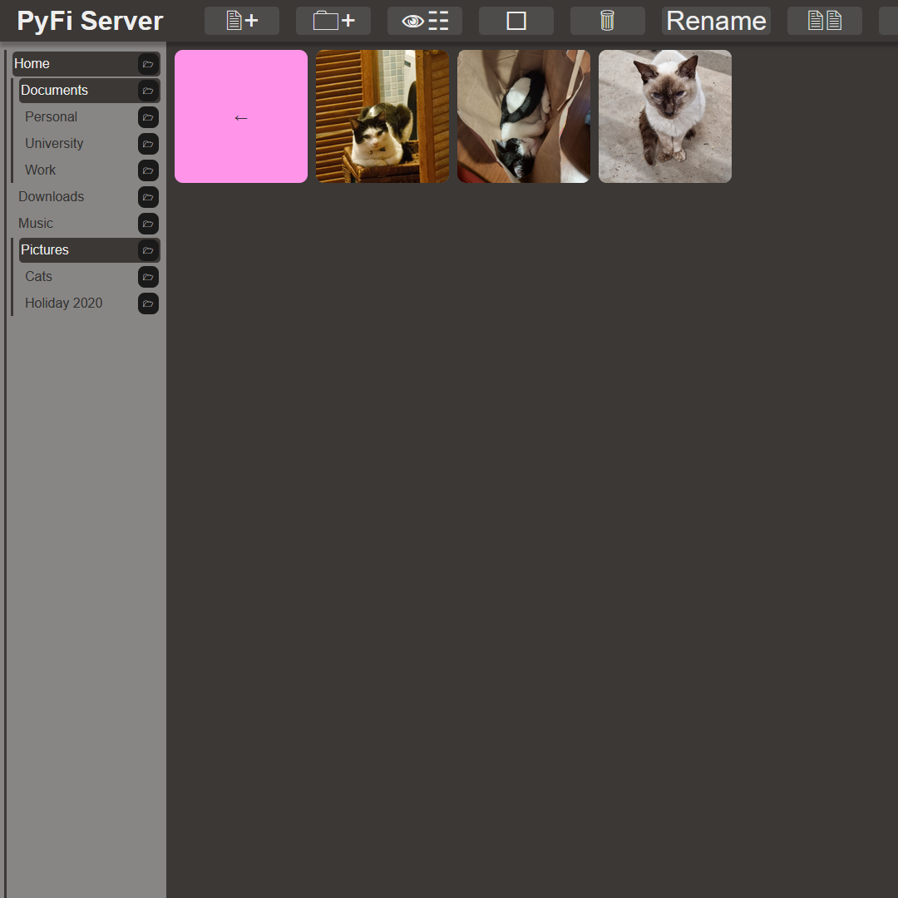

# React File Server

## Setup

**This project requires the [Python Web Server](https://github.com/connorturlan/web-server-py) project to run.** By default this includes the file server module.

Clone to repo and install all dependencies with:

`npm i`

Then you can run the program locally with:

`npm run dev`

## MVP

Create a front-end interface for the Python Web Server using React.

The app should:

-   Allow a user to download, and upload files/folders on a remote file system.
-   Provide basic functionality to copy and move files on the remote file system.
-   Provide navigation features for folders in the system.
-   Provide a preview of supported file types within the browser before download.
-   Allow to user to rename files.
-   Provide various views for files, eg. grid, list, etc.
-   Be responsive and be usable across a range of devices.

## Implementation

## Known Issues

-   Use isn't alerted when there is an error with the requested copy/move/rename.
-   Folder tree patch function doesn't update state correctly.

## Retrospective

## Future Plans

-   Use a .env file to for routers to the file server to provide the option for other web servers to be used.
-   Add responsive design.
-   Add icons for common functions to improve UX.
-   Fix the folder tree patch function.

### Potentially

-   Show a breadcrumb trail.
-   Flesh out upload dialog.

## Related Projects

-   [Python Web Server](https://github.com/connorturlan/web-server-py) - A File Server host that this project was build to work around.

## License

CC by attribution non-commercial, derivatives allowed.

## Contributions

Made by Connor Turlan 2022.
